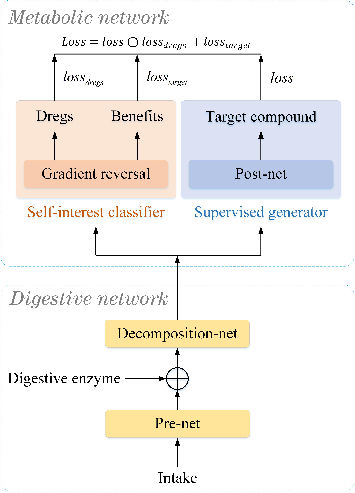

In this post, we show the demo of the functional Digestive Metabolic Network for TTS

### Overview

The current typical text-to-speech (TTS) techniques fail to perform well on differentiating each speaker's timbre information from the multi-speaker speech dataset. Specially, when the target speaker takes a small proportion of the dataset compared with other speakers, other speakers will severely influence the timbre and pitch of generated speech. This is a difficult problem in TTS. Inspired by animals' digestive process and metabolic activity after taking intake, we propose firstly a general bionic architecture, functional Digestive Metabolic Network (DMN), which could exploit the traditional TTS model. The DMN consists of a digestive network containing pre-net and decomposition-net, and a metabolic network including self-interest classifier and supervised generator. It can ignore the dregs and then absorb the benefits of intake to generate target compound. Simultaneously, we introduce the functional digestive enzyme concept to enhance the performance. Considering the above problem of TTS, we embed the Tacotron2 into the DMN framework, as well as adding the timbre feature as the digestive enzyme. Ablation experiment on the multi-speaker speech dataset shows that the proposed DMN has improved greatly the performance of Tacotron2 on Mean Opinion Score (MOS) and Voice Similarity Score (VSS).

### Model Architecture
<!-- 

    
    

Figure.1 The architecture of the functional digestive metabolic network,
 -->

<table>
    <tr>
        <td >
(A) DMN 
</td>
        <td >
(B) < br > < br > FDMN 
</td>
    </tr>
</table>

Figure.1 (A) The architecture of the functional digestive metabolic network (DMN). (B) The architecture of the functional digestive metabolic network (FDMN).

<!-- ### General Digestive Metabolic Network

Figure.1 The architecture of the general digestive metabolic network.

### Functional Digestive Metabolic Network

Figure.2 The architecture of the functional digestive metabolic network.
 -->

### Results

<table>
    <tr>
        <th> ID </th>
        <th> DMN</th>
        <th> FDMN </th>
        <th> Tacotron2 </th>
        <th> Tacotron2+x-vector </th>
    </tr>
    <tr>
        <th> 1 </th>
        <th> <audio controls id="player" onplay="pauseOthers(this);"><source src="assets/audios/DMN/30/0.mp3" type="audio/mpeg"></audio> </th>
        <th> <audio controls id="player" onplay="pauseOthers(this);"><source src="assets/audios/FDMN/30/0.mp3" type="audio/mpeg"></audio> </th>
        <th> <audio controls id="player" onplay="pauseOthers(this);"><source src="assets/audios/Tacotron2/30/0.mp3" type="audio/mpeg"></audio> </th>
        <th> <audio controls id="player" onplay="pauseOthers(this);"><source src="assets/audios/Tacotron2_x-vec/30/0.mp3" type="audio/mpeg"></audio> </th>
    </tr>
    <tr>
        <th> 2</th>
        <th> <audio controls id="player" onplay="pauseOthers(this);"><source src="assets/audios/DMN/30/1.mp3" type="audio/mpeg"></audio> </th>
        <th> <audio controls id="player" onplay="pauseOthers(this);"><source src="assets/audios/FDMN/30/1.mp3" type="audio/mpeg"></audio> </th>
        <th> <audio controls id="player" onplay="pauseOthers(this);"><source src="assets/audios/Tacotron2/30/1.mp3" type="audio/mpeg"></audio> </th>
        <th> <audio controls id="player" onplay="pauseOthers(this);"><source src="assets/audios/Tacotron2_x-vec/30/1.mp3" type="audio/mpeg"></audio> </th>
    </tr>

      <tr>
        <th> 3 </th>
        <th> <audio controls id="player" onplay="pauseOthers(this);"><source src="assets/audios/DMN/30/2.mp3" type="audio/mpeg"></audio> </th>
        <th> <audio controls id="player" onplay="pauseOthers(this);"><source src="assets/audios/FDMN/30/2.mp3" type="audio/mpeg"></audio> </th>
        <th> <audio controls id="player" onplay="pauseOthers(this);"><source src="assets/audios/Tacotron2/30/2.mp3" type="audio/mpeg"></audio> </th>
        <th> <audio controls id="player" onplay="pauseOthers(this);"><source src="assets/audios/Tacotron2_x-vec/30/2.mp3" type="audio/mpeg"></audio> </th>
    </tr>

​    
​      <tr>
​        <th> 4 </th>
​        <th> <audio controls id="player" onplay="pauseOthers(this);"><source src="assets/audios/DMN/30/3.mp3" type="audio/mpeg"></audio> </th>
​        <th> <audio controls id="player" onplay="pauseOthers(this);"><source src="assets/audios/FDMN/30/3.mp3" type="audio/mpeg"></audio> </th>
​        <th> <audio controls id="player" onplay="pauseOthers(this);"><source src="assets/audios/Tacotron2/30/3.mp3" type="audio/mpeg"></audio> </th>
​        <th> <audio controls id="player" onplay="pauseOthers(this);"><source src="assets/audios/Tacotron2_x-vec/30/3.mp3" type="audio/mpeg"></audio> </th>
​    </tr>

​    
​    
​      <tr>
​        <th> 5 </th>
​        <th> <audio controls id="player" onplay="pauseOthers(this);"><source src="assets/audios/DMN/30/4.mp3" type="audio/mpeg"></audio> </th>
​        <th> <audio controls id="player" onplay="pauseOthers(this);"><source src="assets/audios/FDMN/30/4.mp3" type="audio/mpeg"></audio> </th>
​        <th> <audio controls id="player" onplay="pauseOthers(this);"><source src="assets/audios/Tacotron2/30/4.mp3" type="audio/mpeg"></audio> </th>
​        <th> <audio controls id="player" onplay="pauseOthers(this);"><source src="assets/audios/Tacotron2_x-vec/30/4.mp3" type="audio/mpeg"></audio> </th>
​    </tr>

</table>
